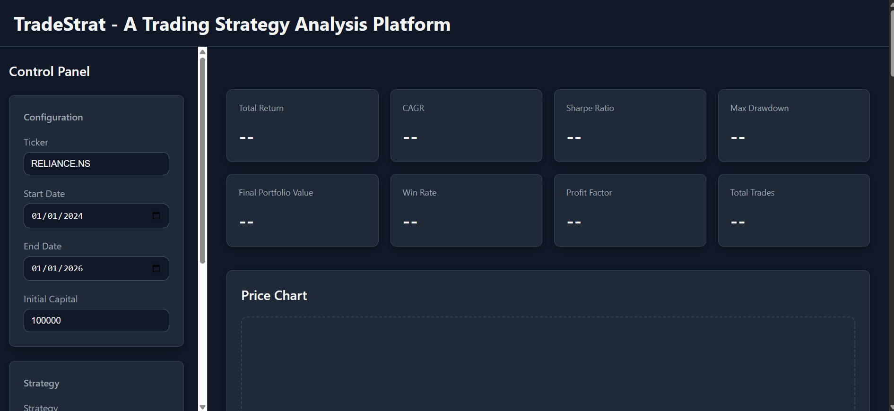
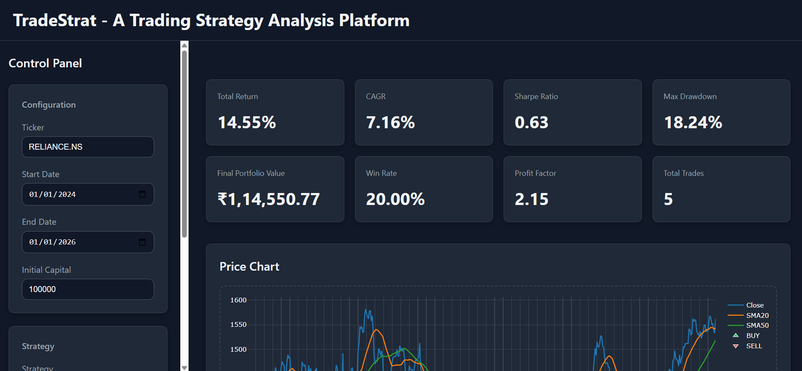
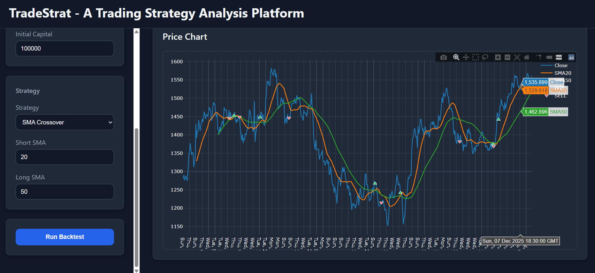
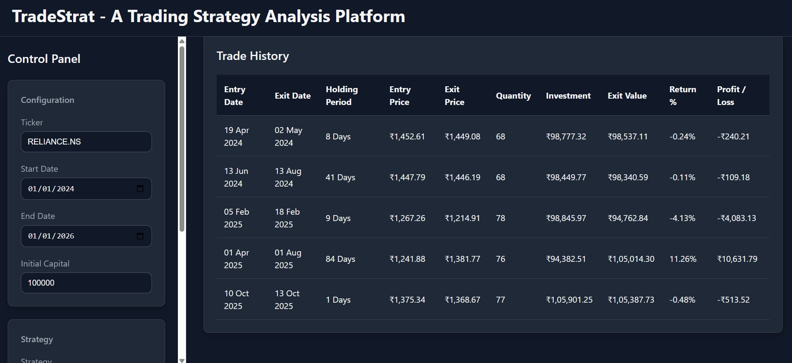

# TradeStrat
A web-based modular trading strategy analysis platform for backtesting, portfolio simulation and performance evaluation on historical stock market data.

## Features

- Historical market data download using Yahoo Finance
- Market data validation and cleaning
- Generic technical indicator engine
- SMA crossover strategy
- Portfolio simulation
- Performance analytics
- Risk metrics
- Trade statistics
- Interactive dashboard
- Plotly visualizations
- REST API

## Screenshots

  

  

  

  

## Technology Stack

| Category | Technologies |
|----------|--------------|
| **Backend** | Python, Flask |
| **Frontend** | HTML5, CSS3, JavaScript |
| **Data Processing** | Pandas, NumPy |
| **Market Data** | Yahoo Finance (`yfinance`) |
| **Data Visualization** | Plotly, Plotly.js |
| **Testing** | pytest |

## Version History

### Version 1.0

Initial MVP release.

Completed:

- Market Data Module
- Indicator Engine
- SMA Strategy
- Portfolio Simulator
- Analytics Engine
- REST API
- Interactive Dashboard