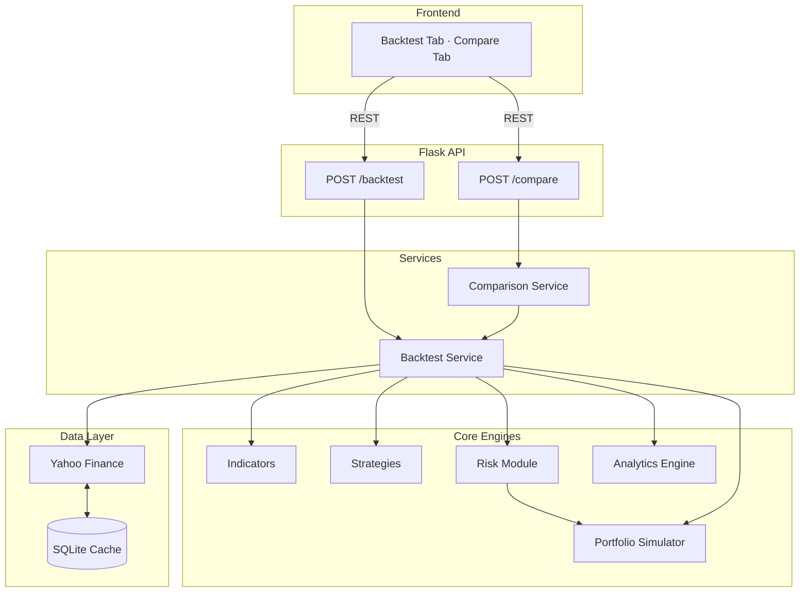
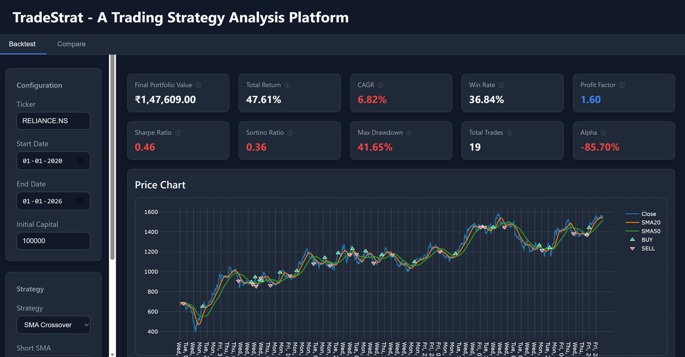
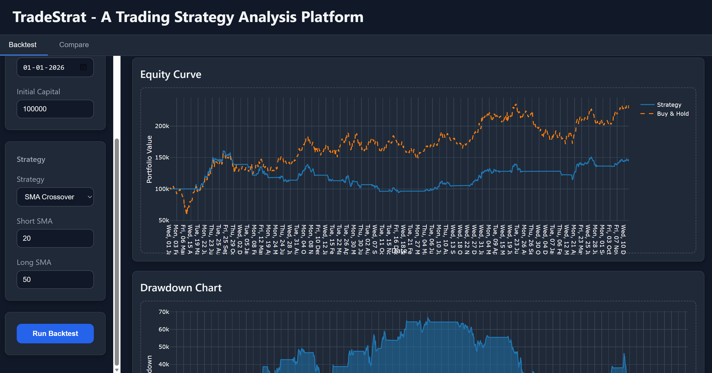
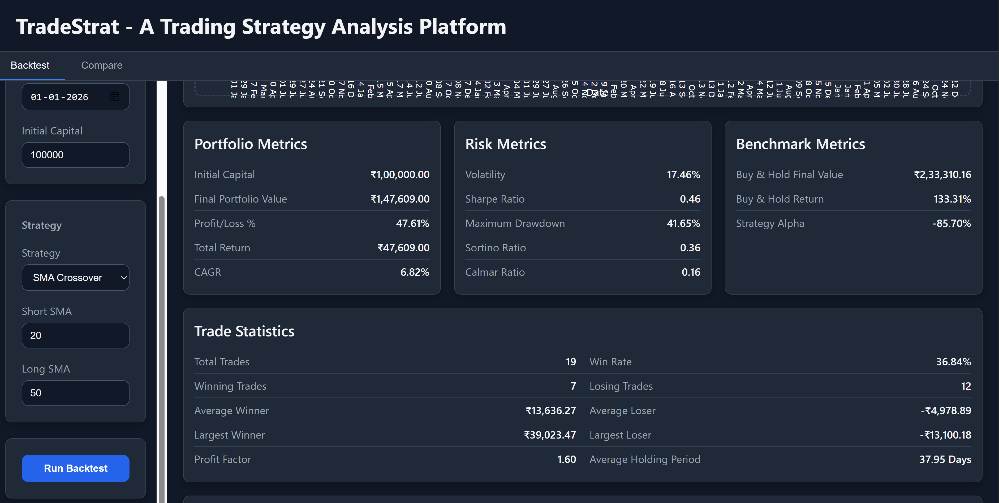
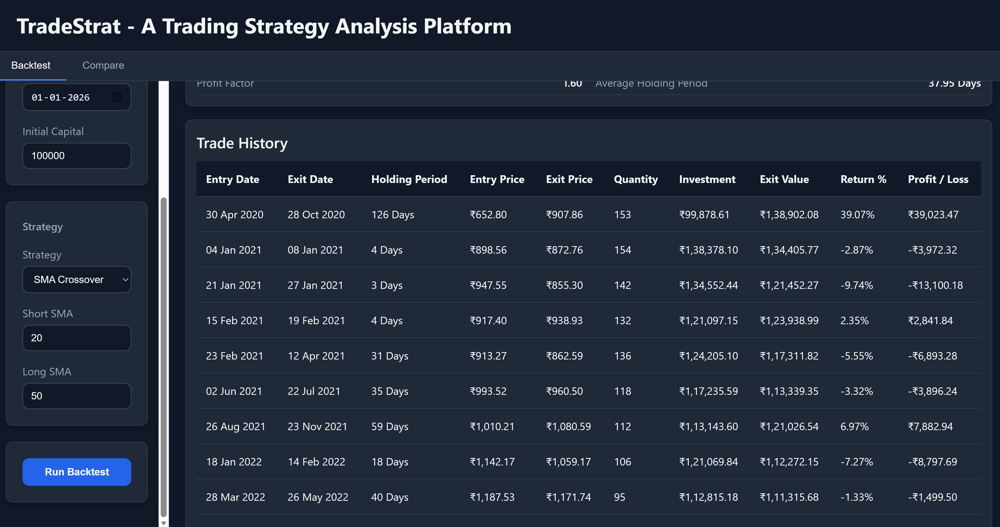
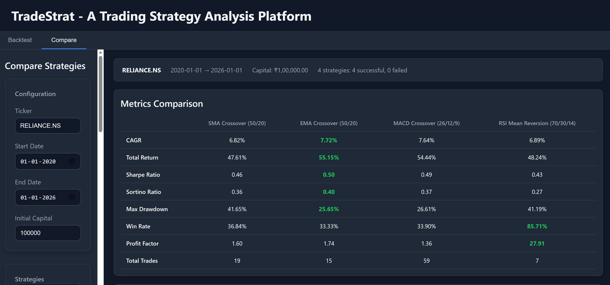
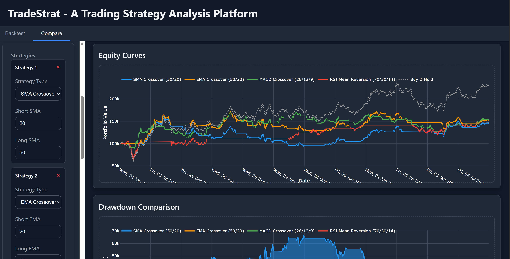
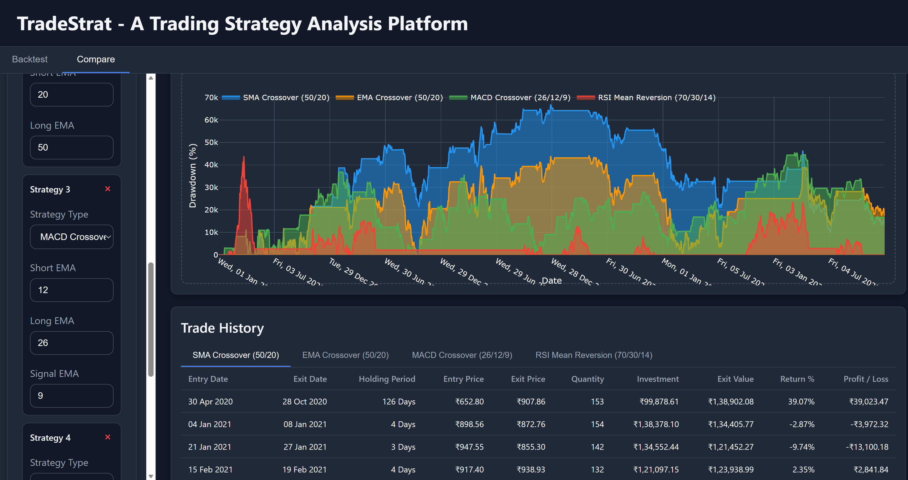
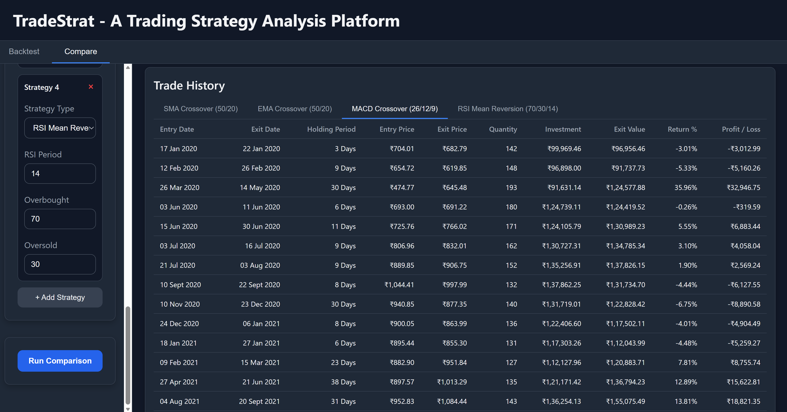

# TradeStrat
A web-based modular trading strategy analysis platform for backtesting, portfolio simulation and performance evaluation on historical stock market data.

## Features

- **Market Data** — Historical data download via Yahoo Finance with local SQLite caching
- **Technical Indicators** — SMA, EMA, RSI, MACD with automatic warm-up period handling
- **Trading Strategies** — SMA Crossover, EMA Crossover, MACD Crossover, RSI Mean Reversion
- **Portfolio Simulation** — Full trade lifecycle simulation with configurable initial capital
- **Risk Management** — Pluggable stop-loss framework with dropdown selection and dynamic parameters (Fixed Percentage, Fixed Price Offset, Trailing Stop)
- **Performance Analytics** — Portfolio metrics, risk metrics, and trade statistics
- **Benchmark Comparison** — Buy & Hold benchmark overlay with alpha calculation
- **KPI Interpretation** — Color-coded KPI cards with interpretation levels and hover tooltips
- **Strategy Comparison** — Run 2–6 strategies side-by-side with metrics matrix, equity/drawdown chart overlays, and per-strategy trade history tabs
- **Interactive Dashboard** — Plotly charts (price, equity, drawdown), tabbed interface (Backtest / Compare), form persistence via localStorage

## Architecture

```mermaid
graph TD
    subgraph Frontend
        UI[Backtest Tab · Compare Tab]
    end

    subgraph API[Flask API]
        B[POST /backtest]
        C[POST /compare]
    end

    subgraph Services
        BS[Backtest Service]
        CS[Comparison Service]
    end

    subgraph Engines[Core Engines]
        IND[Indicators]
        STR[Strategies]
        RISK[Risk Module]
        SIM[Portfolio Simulator]
        ANA[Analytics Engine]
    end

    subgraph Data[Data Layer]
        DL[Yahoo Finance]
        DB[(SQLite Cache)]
    end

    UI -->|REST| B
    UI -->|REST| C
    B --> BS
    C --> CS
    CS --> BS
    BS --> IND
    BS --> STR
    BS --> RISK
    RISK --> SIM
    BS --> SIM
    BS --> ANA
    BS --> DL
    DL <--> DB
```

## Screenshots

### Backtest Tab

<table>
  <tr>
    <td></td>
    <td></td>
  </tr>
  <tr>
    <td></td>
    <td></td>
  </tr>
</table>

### Compare Tab

<table>
  <tr>
    <td></td>
    <td></td>
  </tr>
  <tr>
    <td></td>
    <td></td>
  </tr>
</table>

## Technology Stack

| Category | Technologies |
|----------|--------------|
| **Backend** | Python, Flask |
| **Frontend** | HTML5, CSS3, JavaScript |
| **Data Processing** | Pandas, NumPy |
| **Market Data** | Yahoo Finance (`yfinance`) |
| **Database** | SQLite (local market data cache) |
| **Data Visualization** | Plotly, Plotly.js |
| **Testing** | pytest |

## Development Changelog

### 2026-07-31 — Fixed Price Offset & Trailing Stop-Loss
- Added `FixedPriceOffsetStopLoss` rule: exits a long trade when price falls to `entry_price - offset`
- Added `TrailingStopLoss` rule: exits a long trade when price falls `percent` below the highest close since entry
- Extended stop-loss rule interface with optional `peak_price` so state-aware rules can reuse the registry
- Simulator now tracks `highest_close` on `OpenTrade` and passes it to `RiskManager`
- Registered `fixed_price_offset` and `trailing_stop` in both backend and frontend `STOP_LOSS_REGISTRY`
- Frontend dropdown now includes "Fixed Price Offset" and "Trailing Stop" with dynamic parameter fields
- Added unit, simulator integration, and API route tests for both new stop-loss types

### 2026-07-30 — Pluggable Stop-Loss Framework
- Refactored risk system into a registry-based architecture: `RiskConfig` now uses `stop_loss_type` + `stop_loss_parameters` instead of hard-coded fields
- Added `STOP_LOSS_REGISTRY` (backend + frontend) so new stop-loss types require only a rule class and a registry entry
- Frontend stop-loss selection now uses a dropdown with dynamic parameter fields (mirroring the strategy pattern)
- Updated API payload shape: `{ "risk": { "stop_loss_type": "...", "parameters": { ... } } }`

### 2026-07-29 — Fixed Stop-Loss Risk Support
- Added risk configuration layer for backtest requests with optional fixed stop-loss settings
- Portfolio simulation now supports automatic stop-loss exits with proper trade history recording
- Improved stop-loss UI: field hidden by default, enabled with checkbox, validated to prevent empty submissions
- Added "Exit Reason" column to trade history showing whether exit was via strategy signal or stop-loss trigger

### 2026-07-28 — Compare Tab Form Persistence
- Added form persistence for the Compare tab via localStorage

### 2026-07-27 — Strategy Comparison Tab
- Added Strategy Comparison Tab for running 2–6 strategies side-by-side on the same ticker and date range
- Comparison dashboard with metrics matrix (best-value highlighting), overlaid equity and drawdown charts, and per-strategy trade history tabs
- Added `POST /compare` API endpoint with per-strategy error isolation

### 2026-07-24 — Market Data Caching
- Added local SQLite database for caching downloaded market data
- Cache-first retrieval eliminates redundant Yahoo Finance API calls across repeated backtests
- Automatic range merging consolidates overlapping cached date ranges

### 2026-07-22 — Dashboard UI Overhaul & KPI Interpretation System
- Redesigned dashboard layout: compacted KPI grid, 3-column metrics, narrower sidebar
- Added backend KPI Interpreter module with dedicated `kpi_cards` response object
- KPI values are now color-coded based on interpretation levels (Excellent, Good, Average, Poor)
- Color coding applied to CAGR, Profit Factor, Sharpe Ratio, Sortino Ratio, Max Drawdown and Alpha
- Added hover tooltips on each KPI card with metric explanations and interpretation ranges

### 2026-07-20 — Benchmark Comparison & Extended Risk Metrics
- Added Buy & Hold benchmark comparison with passive equity curve overlay on the Equity Chart
- Added Benchmark Metrics panel displaying Buy & Hold Final Value, Buy & Hold Return, and Strategy Alpha
- Added Sortino Ratio and Calmar Ratio to Risk Metrics

### 2026-07-15 — Error Handling
- Added user-friendly error modal for frontend and backend validation errors

### 2026-07-14 — Loading Overlay
- Added full-screen loading overlay during backtest execution

### 2026-07-13 — RSI Strategy, Chart Interaction & Warm-up Fix
- Added trading strategy: RSI Mean Reversion
- Improved chart interaction: mouse-wheel zoom, drag to pan
- Added automatic indicator warm-up period for more accurate recursive indicator calculations
- Fixed bug where consecutive BUY/SELL signals generated via RSI Mean Reversion strategy were causing incorrect backtest results

### 2026-07-12 — Indicators & Strategy Expansion
- Added EMA, RSI and MACD indicators
- Added trading strategies: EMA Crossover, MACD Crossover

### 2026-07-10 — Frontend Dashboard
- Created a dashboard for triggering backtests and viewing analytics results
- Added interactive dashboard with Plotly charts (price, equity curve, drawdown) and trade history table
- Strategy parameters are now dynamically rendered from a central registry

### 2026-07-09 — Serialization Fix
- Fixed a bug in JSON serialization of NaN values

### 2026-07-08 — Backtest Service & API
- Added backtest service layer for orchestration of the backtest workflow
- Added `POST /backtest` REST API endpoint with JSON request/response

### 2026-07-04 — Analytics Engine
- Added Analytics Engine with portfolio metrics, risk metrics, and trade statistics

### 2026-07-01 — Portfolio Simulator
- Added Portfolio Simulator for trade lifecycle execution with configurable initial capital

### 2026-07-01 — Data Module, Indicator Engine & Strategy Engine
- Added Market Data module for downloading and cleaning historical stock data via Yahoo Finance
- Added generic Indicator Engine with SMA indicator implementation
- Added Strategy Engine with SMA Crossover strategy

### 2026-06-30 — Project setup and initial commit
- Added basic flask project structure and API blueprint
- Added logging module
