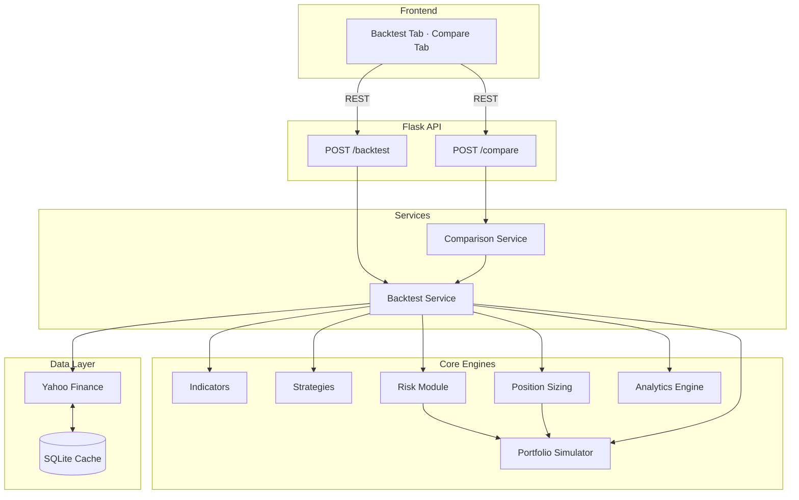

# TradeStrat
A web-based modular trading strategy analysis platform for backtesting, portfolio simulation and performance evaluation on historical stock market data.

[Live Demo](https://tradestrat.onrender.com/) — Try the deployed application

## Features

- **Market Data** — Historical data download via Yahoo Finance with local SQLite caching
- **Technical Indicators** — SMA, EMA, RSI, MACD, BB with automatic warm-up period handling
- **Trading Strategies** — SMA Crossover, EMA Crossover, MACD Crossover, RSI Mean Reversion, BB Bounce
- **Portfolio Simulation** — Full trade lifecycle simulation with configurable initial capital and position accumulation
- **Position Sizing** — Pluggable position sizing framework with dropdown selection and dynamic parameters (All-In, Fixed Percentage, Fixed Amount, Fixed Shares, Risk-Based)
- **Risk Management** — Pluggable stop-loss and take-profit framework with dropdown selection and dynamic parameters (Stop-Loss: Fixed Percentage, Fixed Price Offset, Trailing Stop; Take-Profit: Fixed Percentage, Fixed Amount)
- **Performance Analytics** — Portfolio metrics, risk metrics, and trade statistics
- **Benchmark Comparison** — Buy & Hold benchmark overlay with alpha calculation
- **KPI Interpretation** — Color-coded KPI cards with interpretation levels and hover tooltips
- **Strategy Comparison** — Run 2–6 strategies side-by-side with metrics matrix, equity/drawdown chart overlays, and per-strategy trade history tabs
- **Interactive Dashboard** — Plotly charts (price, equity, drawdown), tabbed interface (Backtest / Compare), form persistence via localStorage
- **Advanced Charting** — Candlestick/line chart toggle, indicator subplots (RSI, MACD) with linked x-axes, signal/execution marker overlays

## Architecture

```mermaid
graph TD
    subgraph Frontend
        UI[Backtest Tab · Compare Tab]
    end

    subgraph API[Flask API]
        B[POST /backtest]
        C[POST /compare]
    end

    subgraph Services
        BS[Backtest Service]
        CS[Comparison Service]
    end

    subgraph Engines[Core Engines]
        IND[Indicators]
        STR[Strategies]
        RISK[Risk Module]
        PS[Position Sizing]
        SIM[Portfolio Simulator]
        ANA[Analytics Engine]
    end

    subgraph Data[Data Layer]
        DL[Yahoo Finance]
        DB[(SQLite Cache)]
    end

    UI -->|REST| B
    UI -->|REST| C
    B --> BS
    C --> CS
    CS --> BS
    BS --> IND
    BS --> STR
    BS --> RISK
    BS --> PS
    RISK --> SIM
    PS --> SIM
    BS --> SIM
    BS --> ANA
    BS --> DL
    DL <--> DB
```

## Screenshots

### Backtest Tab

<table>
  <tr>
    <td></td>
    <td></td>
  </tr>
  <tr>
    <td></td>
    <td></td>
  </tr>
</table>

### Compare Tab

<table>
  <tr>
    <td></td>
    <td></td>
  </tr>
  <tr>
    <td></td>
    <td></td>
  </tr>
</table>

## Technology Stack

| Category | Technologies |
|----------|--------------|
| **Backend** | Python, Flask |
| **Frontend** | HTML5, CSS3, JavaScript |
| **Data Processing** | Pandas, NumPy |
| **Market Data** | Yahoo Finance (`yfinance`) |
| **Database** | SQLite (local market data cache) |
| **Data Visualization** | Plotly, Plotly.js |
| **Testing** | pytest |
| **CI/CD** | GitHub Actions |
| **Containerization** | Docker |

# Additional Documentation

For more information, refer to:

* `docs/SETUP.md` — Project setup and configuration
* `docs/API.md` — REST API documentation
* `docs/CHANGELOG.md` — Development changelog